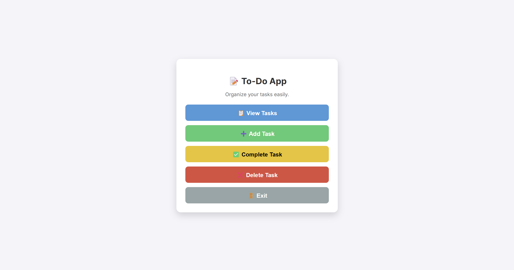
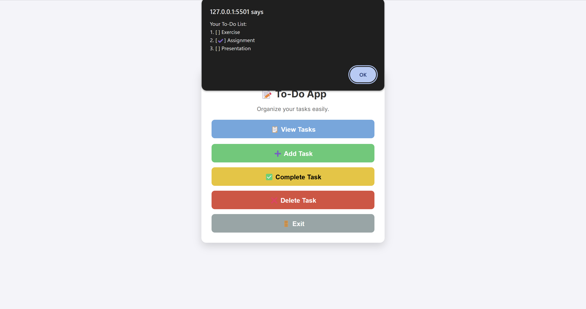

# 📝 To-Do App

A **lightweight, beginner-friendly To-Do application** built with **HTML, CSS, and JavaScript**.  
This app allows users to **add, view, complete, and delete tasks** through a simple and interactive interface.

### 🖼 Preview 1


### 🖼 Preview 2


---

## 🌟 Features
✅ **Simple and clean UI** for easy task management  
✅ **JavaScript prompts for input** (no complex forms)  
✅ **Tasks persist using LocalStorage**  
✅ **Mark tasks as completed with a click**  
✅ **Modern & minimal design with smooth animations**  
✅ **100% Vanilla JavaScript** (no external libraries)  

---

## 📂 Project Structure

| File/Folder   | Description                  |
|--------------|------------------------------|
| `to-do-app/` | Root project folder         |
| ├── `index.html`  | Main HTML structure      |
| ├── `styles.css`  | Styles for the app       |
| ├── `script.js`   | JavaScript logic        |
| └── `README.md`   | Documentation           |

---

## 📥 Installation & Setup
Follow these steps to **clone and run the project locally**:

1. **Clone the repository**:

   ```sh
   git clone https://github.com/bhupeshk3014/to-do-app.git

2. **Navigate to the Project Folder**

    Once you have cloned the repository, navigate to the project folder using the following command:

    ```sh
    cd to-do-app

3. **Open the App in Your Browser**

    > No dependencies or installations required! Just open the HTML file and start using the app.

---

## 🎮 How to Use
1. Click **"Add Task"** to enter a new task.
2. Click **"View Tasks"** to see all tasks.
3. Click **"Complete Task"** to mark a task as done.
4. Click **"Delete Task"** to remove a task.
5. Click **"Exit"** to close the app.

---

## 🛠️ Technologies Used
- **HTML** – Structure of the app
- **CSS** – Styling & Animations
- **JavaScript** – Logic & Functionality
- **LocalStorage** – Task persistence

---

## 🎨 UI Design
The app is designed with a **clean, modern look**, featuring:
✔ A **white, card-style layout** with subtle shadows  
✔ **Smooth hover effects** and button animations  
✔ A **light background** for a professional appearance  

---

## 📜 License
This project is licensed under the **MIT License** – you're free to **use, modify, and distribute** it.

---

## 👨‍💻 Author
💙 Built with ❤️ by **[Bhupesh Kumar](https://github.com/bhupeshk3014)**.  
🚀 If you like this project, don't forget to **star ⭐ the repo**!


